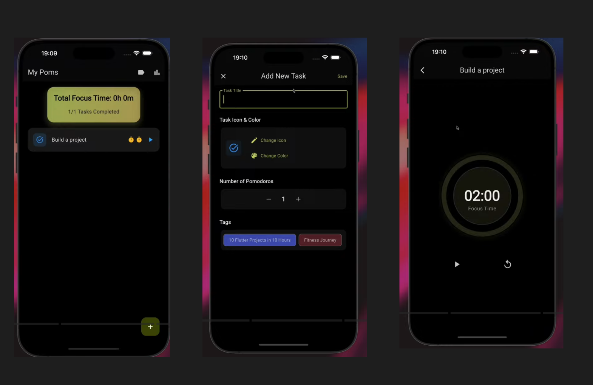

# Pomodoro

Flutter project (learning purpose) 

Replicating Pomodoro app UI and functionality from https://www.youtube.com/watch?v=I2PSCjAR1RY 

## Getting Started

Figma designs - https://www.figma.com/design/iekE3NAbVsjHPr0hFkXxGV/Untitled?node-id=0-1&t=1nc0QJr6dCsIbUU5-1 

Below image shows the three pages of application developed in this project



Three main pages of the application are as follows:

1. Home Page - Displays the timer and start/pause button.
2. Add Task Page - Allows users to add new tasks.
3. Task Timer Page - Displays the task name and timer.


## Dependencies

Note: In VS Code, use Pubspec Assist extension to easily add/remove dependencies in pubspec.yaml file.
The project uses the following dependencies (pub.dev packages):

- flex_color_scheme for theming
- riverpod for state management (https://riverpod.dev/docs/introduction/getting_started#installing-the-package)

    1) flutter pub add hooks_riverpod
    2) flutter pub add flutter_hooks
    3) flutter pub add dev:custom_lint
    4) flutter pub add dev:riverpod_lint

- drift for local database (https://drift.simonbinder.eu/docs/getting-started/)
    - dart pub add drift drift_flutter path_provider dev:drift_dev dev:build_runner
    1) flutter pub add drift
    2) flutter pub add drift_flutter
    3) flutter pub add path_provider
    4) flutter pub add dev:drift_dev
    5) flutter pub add dev:build_runner

## Commands 

To create a new Flutter project:

```bash
flutter create pomodoro --platforms=android,ios
```

To run the application:

```bash
flutter run
```

Manage dependencies:

add packages to pubspec.yaml and run the following command to get packages
```bash
flutter pub get
```

flutter doctor command to check for any issues
```bash
flutter doctor
```

To generate the database code using drift:

```bash
dart run build_runner watch
```


## Tips

- Use Physical Device for testing the application for better performance.


## Learn More

This project is a starting point for a Flutter application.

A few resources to get you started if this is your first Flutter project:

- [Lab: Write your first Flutter app](https://docs.flutter.dev/get-started/codelab)
- [Cookbook: Useful Flutter samples](https://docs.flutter.dev/cookbook)

For help getting started with Flutter development, view the
[online documentation](https://docs.flutter.dev/), which offers tutorials,
samples, guidance on mobile development, and a full API reference.
